# Betriebshandbuch

## Inhaltsverzeichnis

- [Infrastruktur](#infrastruktur)
  - [Umgebung](#umgebung)
  - [Hardware](#hardware)
  - [Schnittstellen](#schnittstellen)
- [Inbetriebnahme](#inbetriebnahme)
  - [Zusammenbau](#zusammenbau)
  - [Installation](#installation)
  - [Konfiguration](#konfiguration)
- [Betrieb](#betrieb)
  - [Bedienung](#bedienung)
  - [Updates](#updates)
  - [Troubleshooting](#troubleshooting)
- [Verzeichnisse](#verzeichnisse)
  - [Abbildungen](#abbildungen)
  - [Tabellen](#tabellen)
  - [Quellen](#quellen)

## Infrastruktur

### Umgebung

In meinem Projekt benutzte ich Visual Studio Code mit der PlatformIo Extenstion. PlatformIO ermöglicht es mir, die Software für meine ESP32, in einem Projekt zu entwickeln, kompilieren und hochzuladen. Ich brauche verschiedene Libraries, um die Funktionalität meiner Box zu erweitern. Alle benötigten Libraries sind in der [`platformio.ini`](../code/EchoPlay/platformio.ini) Datei aufgelistet und können einfach über PlatformIO installiert werden.

Benutzte Libraries:

- [adafruit/Adafruit GFX Library@^1.12.1](https://github.com/adafruit/Adafruit-GFX-Library)
- [sparkfun/SparkFun Qwiic Button and Qwiic Switch Library@^2.0.6](https://github.com/sparkfun/SparkFun_Qwiic_Button_Arduino_Library)
- [fbiego/ESP32Time@^2.0.6](https://github.com/fbiego/ESP32Time)
- [holisticsolutions/SimpleSoftTimer](https://registry.platformio.org/libraries/holisticsolutions/SimpleSoftTimer)
- [arduino-libraries/NTPClient](https://github.com/arduino-libraries/NTPClient)

Im obersten Verzeichnis befindet sich ein docs und ein code Ordner, im docs Ordner befinden sich verschiedene Dokumente, die für die Entwicklung und den Betrieb der Box relevant sind. Darunter sind auch dieses Betriebshandbuch und die Technische Dokumentation. Im code Ordner befinden sich 2 Unterordner, der EchoPlay Ordner enthält den Code für die Box, der Snake-in-C Ordner enthält ein Prototyp für das Snake Spiel, welches in C geschrieben ist.

### Hardware

#### Materialliste

Die Original [Materialliste](./EchoPlay_Materialliste_250514.xlsx) befindet sich im docs Ordner. Hier ist eine Übersicht Komponenten:
| Anzahl | Komponente | Preis | Begründung |
|--------|------------|-------|------------|
| 1 | Qwiic Kabel 500mm | CHF 2.58 | Langes Qwiic Kabel für "Controller". |
| 1 | Qwiic Kabel 100mm | CHF 1.68 | Ich brauche noch ein Kabel um die 2 Knöpfe zu verbinden. |
| 2 | Knopf | CHF 8.56 | Knöpfe um die verschiedenen Spiele zu kontrollieren |
| 2 | Steckleiste | CHF 0.74 | Um die Pins auf dem Chip in der LED-Box zu benutzen |
| 1 | DIP300-SOIC-16N | CHF 9.08 | Um die Pins auf dem Chip in der LED-Box zu benutzen |
| 1 | SparkFun Carrier Board | CHF 20.50 | Carrier Board um den ESP32 Prozessor zu halten |
| 1 | SparkFun ESP32 Processor | CHF 20.60 | ESP32 Prozessor um alles zu rechnen |
| 1 | Jumper Kabel M-M 20 pack | CHF 2.32 | Käbel um ESP mit Box zu verbinden |
| | | CHF 66.06 |

##### Materialliste

### Schnittstellen

Für die Entwicklung der Uhr von EchoPlay habe ich den NTPClient benutzt, um die aktuelle Zeit von einem NTP Server zu bekommen.

## Inbetriebnahme

### Zusammenbau

#### LED-Box auseinandernehmen

Zuerst muss man die Schrauben auf der Hinterseite der Box hinausschrauben.

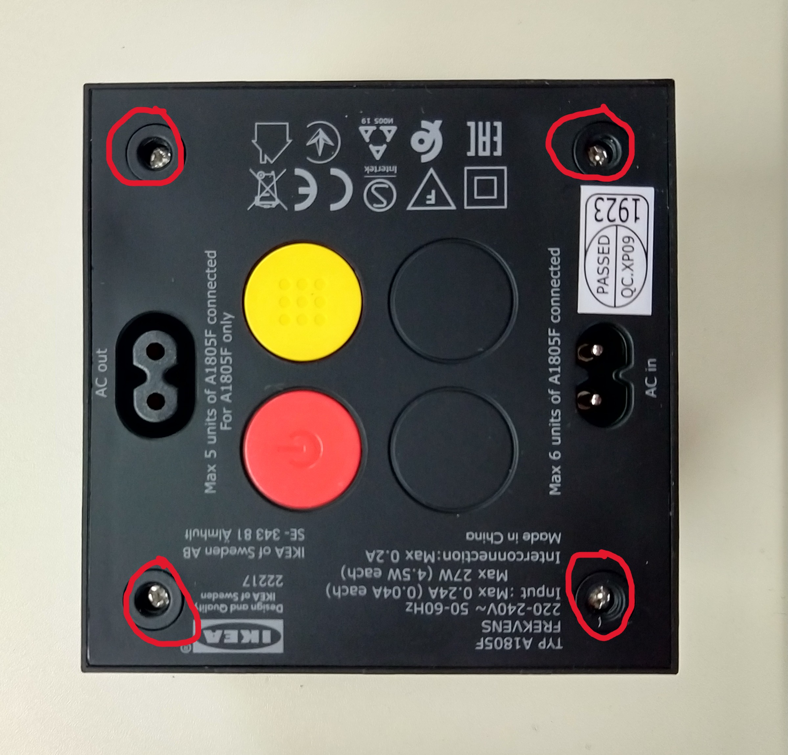

##### LED-Box auseinandernehmen 1

Danach den Deckel entfernen.

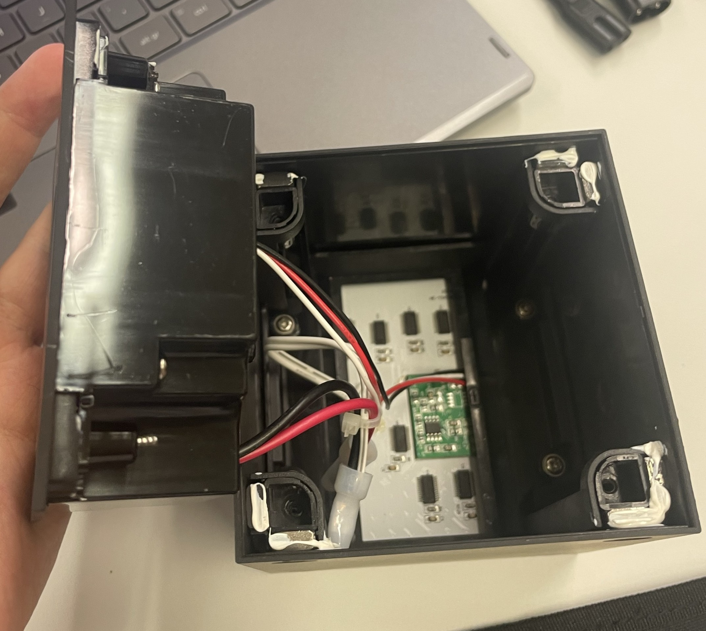

##### LED-Box auseinandernehmen 2

Wenn es offen ist, muss man die 4 Seitenhebel entfernen, diese sind mit Gummi angemacht, also muss man viel Kraft einsetzen.

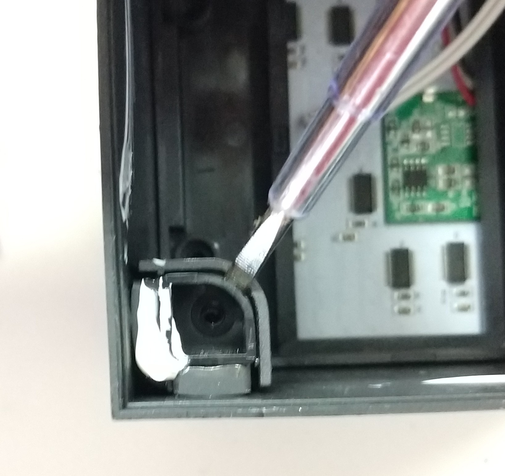$

##### LED-Box auseinandernehmen 3

Danach muss man die Hebel in den Ecken und die Schrauben unten am Gerüst entfernen.

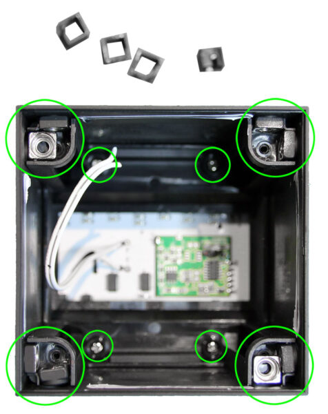

##### LED-Box auseinandernehmen 4

Wenn dies erledigt, muss man alle anderen Hebel in den Ecken entfernen.

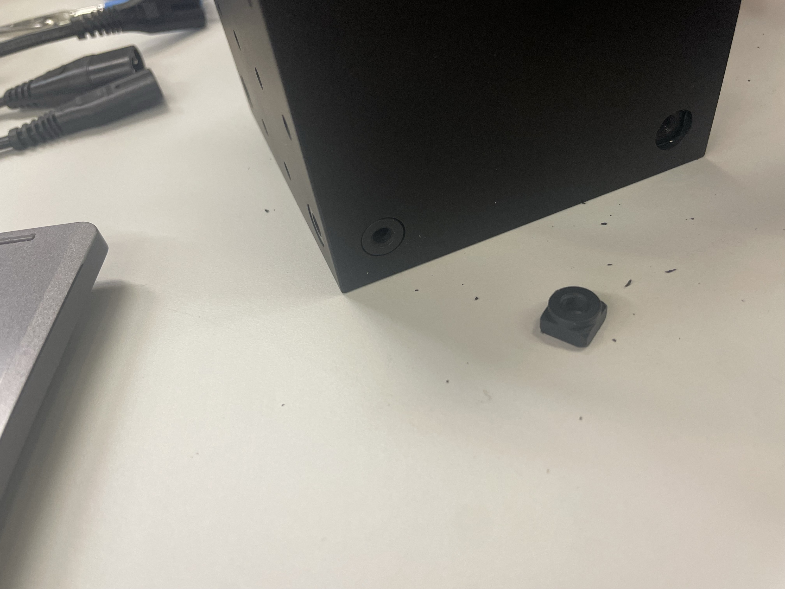

##### LED-Box auseinandernehmen 5

Danach kann man das Gerüst entfernen.

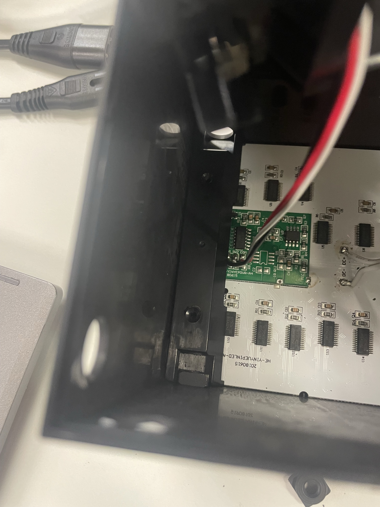
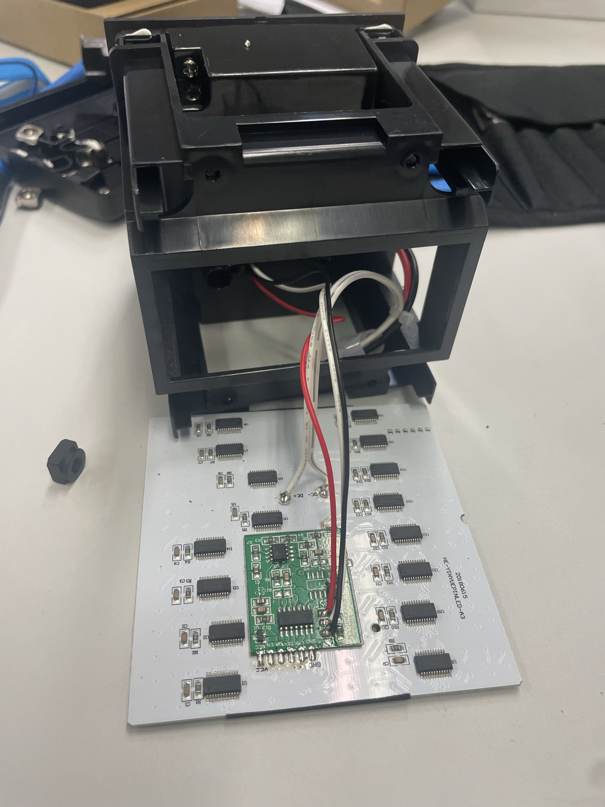

##### LED-Box auseinandernehmen 6

Am Schluss sollte man eine Hülle, 2 Halterungen, 4 Schrauben, 4 Seitenhalterungen, 14 Eck-Halter, LED-Bildschirm und die Stromversorgung haben.


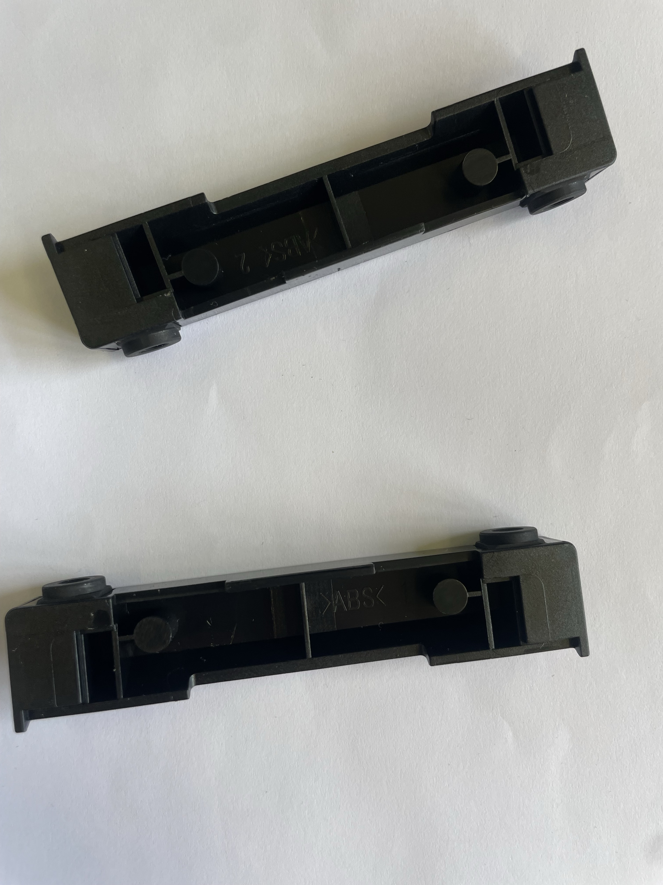
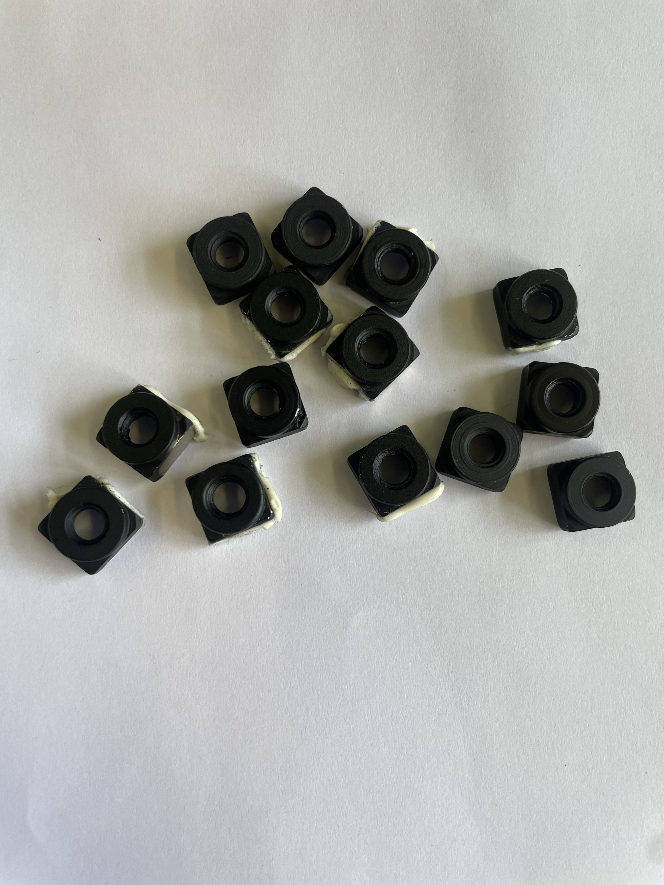
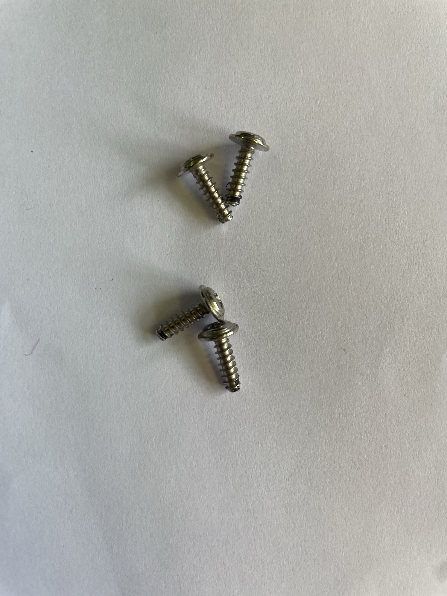
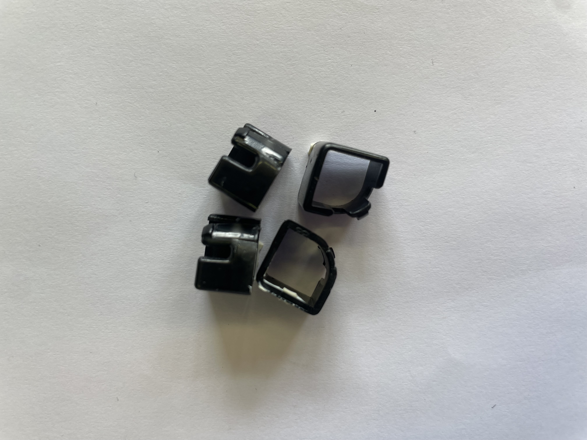
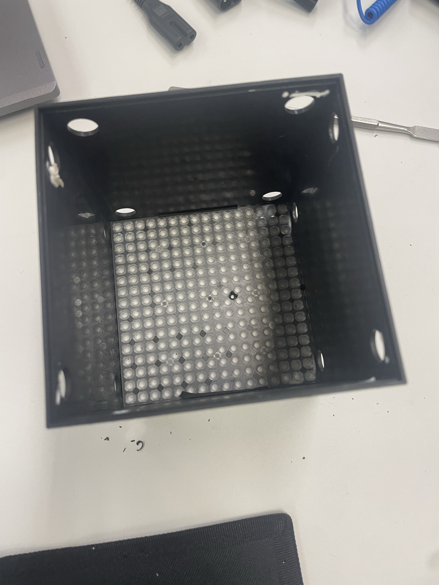

##### LED-Box auseinandernehmen 7

#### Entfernen des PIC16F684

Bevor ich den ESP32 einbauen können, muss der alte Mikrocontroller entfernt werden. Dazu erhitze ich die Lötstellen vorsichtig mit einem Lötkolben und lösen den PIC16F684 aus der Platine. Besonders wichtig ist es, die Leiterbahnen nicht zu beschädigen, da diese später zur Verbindung mit dem Adapter benötigt werden.

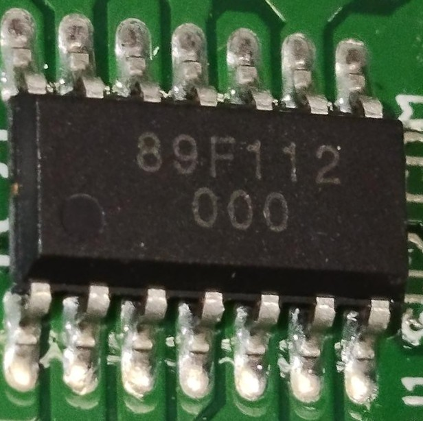

##### PIC16F684 entfernen

#### Pins Löten

Um den ESP32 mit der LED-Box zu verbinden, müssen die ehemaligen Lötstellen des PIC16F684 in steckbare Pins umgewandelt werden. Dafür verwende ich einen DIP300-SOIC-16N Adapter, den ich auf die alten Lötstellen auflöten. Dieser Adapter erlaubt es, eine Verbindung zwischen der SMD-Bauform des alten Controllers und standardmässigen Steckverbindungen herzustellen.

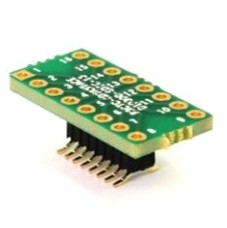

##### Pins Löten 1

Zusätzlich löte ich 14 männlich-zu-weiblich Pins an die Adapterausgänge, um eine flexible Verbindung mit dem ESP32 zu ermöglichen. Dies mache ich mit 2 HRS-1B-07-GA, welche ich in den DIP300-SOIC-16N stecke und diese dann löte.

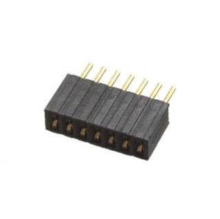

##### Pins Löten 2

Wenn diese Schritte abgeschlossen sind, kann der ESP32 problemlos über männlich-zu-männlich Jumperkabel mit den neu geschaffenen Pin-Verbindungen verbunden werden.

#### LED-Box mit Jumper Kabel zu ESP32 verbinden

Jetzt kann ich die LED-Box mit dem ESP32 so verbinden wie im Plan gezeigt.

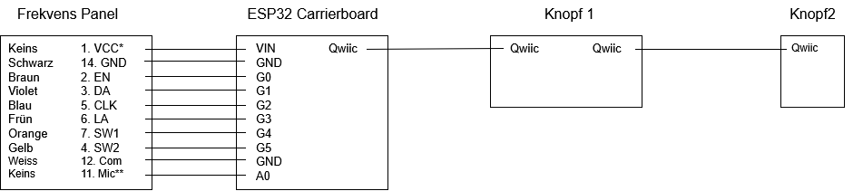

##### LED-Box verbinden

#### LED-Box zusammensetzen

Damit EchoPlay wieder schön und stabil aussieht, muss ich sie wieder zusammensetzten. Die Kabel habe ich durch die Löcher der Eckhalter gezogen und nach aussen mit dem ESP32 verbunden. Sodass alle Komponente Stabil und am richtigen Platz sind, habe ich die Komponente an ein Holzbrett befestigt.

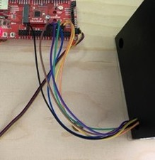

##### LED-Box zusammensetzen

### Installation

Visual Studio Code kann man [hier](https://code.visualstudio.com/download) herunterladen.
Wenn Visual Studio Code heruntergeladen ist, kann bei den Extensions die Extension PlatformIO herunterladen. Nach dem download von PlatformIO kann man den Code für die Box herunterladen, indem man das Repository von Github klont oder die Dateien direkt herunterlädt. Sobald man die Dateien auf dem Computer hat, kann man die PlatformIO Extension in Visual Studio Code öffnen und das Projekt laden. In der `platformio.ini` Datei sind alle benötigten Libraries aufgelistet, diese können einfach über PlatformIO installiert werden.

### Konfiguration

Um die Uhr auf EchoPlay benutzen zu können muss dieser Internetzugriff haben, damit er die aktuelle Zeit von einem NTP Server holen kann. Dafür muss man im EchoPlay odrner und lib einen Ordner namens "Sectet" erstellen. In diesem Ordner muss man eine Datei namens "Secrets.h" erstellen. In dieser Datei muss man zwei Variabeln definieren.

```cpp
const char *WIFI_SSID = "Deine_WLAN_SSID";
const char *WIFI_PASSWORD = "Dein_WLAN_Passwort";
```

## Betrieb

### Bedienung

Um EchoPlay zum starten zu bringen muss man der Box zuerst Strom geben. Hinten auf der Box hat es ein anschluss für ein Stromkabel, dort ein Stromkabel einstecken.

Nachdem Einstecken sollte die LED-Box mit dem Titelscreen eines Spieles aufleuchten, wenn nicht dann muss der Rote Knopf auf der Rückseite gedrückt werden.

Jetzt kann der Spass anfangen, auf der Box sind Klassiker wie Snake und Arkanoid. Um zwischen den Spielen zu wechseln muss man den Gelben Knopf auf der Rückseite drücken.

### Allgemein

Spiele sind so aufgebaut das sie einen Start, das eigentliche Spiel und ein Ende haben. Um ein Spiel zu starten muss man irgeneinen Knopf drücken, dann wenn das Spiel fertig ist, also wenn man das Spiel verliert oder gewinnt, kommt man zum ende wo man dann wieder irgendein Knopf drücken muss um wieder von vorne zu beginnen.

### Snake

Snake startet mit einem Titlescreen aufdem gross Snake drauf steht. Nachdem start des Spieles kommt man in ein Menü auf welchem man die Schweirigkeit auswählen kann. Die Schwierigkeit bestimmt wie schnell die Schlange sich bewegt und kann mit dem Drücken der Knöpfe kontrolliert werden. Um die Schweirigkeit auszuwählen und Snake zu starten muss man dann beide Knöpfe gleichzeitig drücken.

Im eigentlichen Spiel ist das Ziel so lange wie möglich zu werden, dies erzielt man indem man die Äpfel, welche auf dem Screen erscheinen, isst. Um die Schlange zu kontrollieren muss man den Linken und den Rechten Knopf drücken. Der Linke Knopf dreht die Schlange nach links und der Rechte Knopf die Schlange nach rechts. Wenn man mit der Wand oder mit sich selbst kollidiert, verliert man.

### Car-Jump

Car-Jump startet mit einer kleinen Animation aufdem ein Man über ein Auto hüpft. Nachdem start, kontrolliert man den kleinen Man welche unten Links steht. Es kommen immerwieder verschiedene Hindernisse auf dich zu und du musst ihnen ausweichen. Das machst du indem du dich mit der Linken Taste hüpfst oder dich mit der rechten Taste duckst. Wenn ein Hinderniss dich berührt, verlierst du. Ziel ist es so lange wie möglich nicht von einem Hinderniss berührt zu werden.

### Arknaoid

Arkanoid started mit einem Titelscreen aufdem Arkanoid steht. Nachdem start kontrolliert man eine Platform unten am Bildschirm, mit dem linken Knopf bewegst du dich nach links und mit dem rechten Knopf nach rechts. Es hat oben eine Einheit von Blöcken und Ziel ist alle diese Blöcke zu zerstören. Die Blöcke können nur durch das kollidieren mit dem Ball zerstört werden und dieser Ball bewegt sich mit konstanter Geschwindigkeit überall herum. Du musst dafür sorgen das der Ball nicht auf den Boden fällt, sonst geht der Ball kaputt und du verlierst. Wenn der Ball auf der Platform aufprallt geht der Ball in die Richtung auf die er abgeprallt ist, also wenn der Ball auf der rechten Seite der Platform abprallt geht der Ball nach rechts, so kann man den Ball gut kontrollieren.

### Uhr

Die Uhr zeigt die Aktuelle Zeit in der Schweiz an. Es hat zwei Modi, eine zeigt die Zeit und die andere das Datum. Man kann mit dem linken und rechten Knopf zwischen diesen wechseln.

### Updates

Wenn eine neue Version von EchoPlay verfügbar ist, wird dies auf der [GitHub-Seite](https://github.com/gbssg/ims.project.echoplay) hochgeladen. Um die neue Version zu installieren, muss man die neue Version des Codes herunterladen und in Visual Studio Code öffnen. Dann kann man den Code einfach über PlatformIO auf den ESP32 hochladen.

### Troubleshooting

Wenn EchoPlay nicht richtig funktioniert, gibt es einige Schritte, die man unternehmen kann, um das Problem zu beheben:

1. Überprüfen Sie die Stromversorgung: Stellen Sie sicher, dass die Box ordnungsgemäss mit Strom versorgt wird und dass alle Kabel richtig angeschlossen sind.
2. Überprüfen Sie die Software: Stellen Sie sicher, dass die neueste Version der Software auf dem ESP32 installiert ist und dass alle benötigten Libraries korrekt installiert sind. Sie können den Reset-Knopf auf dem Carrier-Board drücken, um den ESP32 neu zu starten.
3. Überprüfen Sie die Verbindungen: Stellen Sie sicher, dass alle Verbindungen zwischen dem ESP32 und der LED-Box korrekt sind und dass keine Pins beschädigt oder lose sind.

Wenn nur einer oder beide der Knöpfe nicht funktionieren, kann das heissen das die Andressen welche im Code gebraucht werden nicht gleiche wie die, die die Knöpfe wirklich haben. Um diese Problem zu lösen muss man:

1. Kommentiere den ganzen main code aus indem man ctrl + a drückt und dann ctrl + k + c drückt.
2. Gehe im EchoPlay Ordner mit dem Code auf den .pio Ordner, lipdeps, SparkFun Qwiic Button and Qwiic Switch Library dann unter examples auf Example5_ChangeI2CAddress. Wähle den ganzen Code in der Datei in diesem Ordner aus und kopiere es mit ctrl + c, dann gehe wieder in den main und füge den Code zuunterst ein mit ctrl + v.
3. Jetzt beim ESP32 siehe zu das nur 1 der 2 QwiicButton eingesteckt ist.
4. Jetzt lade den Code mit dem Upload Knopf auf PlatformIO auf den Chip.
5. Im Serial Monitor, welches man oben rechts bei Visual Studio code öffnen kann, sieht ihr dann Text welches sagt das ein Knopft endeckt wurde. Ihr wollte die Address dieses Knopfes ändern also geht ihr weiter. Dann könnt ihr für euern Knopf den ihr als linken Knopf braucht die Address 0x0C eingeben. Jetzt könnt ihr diesen Knopf ausstecken und den anderen ein stecken und für diesen die Addresse 0x10 eingeben. Merkt euch welches der linke und welches der rechte Knopf ist.
6. Jetzt könnt ihr beide Knöpf wieder gleich einstecken wie am Anfang und denn Code welches ihr im main eingefügt habt löschen und den originallen main code wieder auskommentieren indem ihr alles auswählt und ctrl + k + u drückt.

Wenn die Uhr nicht funktioniert, überprüfen Sie die WLAN-Verbindung und stellen Sie sicher, dass die "Secrets.h" Datei korrekt konfiguriert ist. Anleitung findet man unter [Konfiguration](#konfiguration).

# Verzeichnisse

## Abbildungen

- [LED-Box auseinandernehmen 1](#led-box-auseinandernehmen-1)
- [LED-Box auseinandernehmen 2](#led-box-auseinandernehmen-2)
- [LED-Box auseinandernehmen 3](#led-box-auseinandernehmen-3)
- [LED-Box auseinandernehmen 4](#led-box-auseinandernehmen-4)
- [LED-Box auseinandernehmen 5](#led-box-auseinandernehmen-5)
- [LED-Box auseinandernehmen 6](#led-box-auseinandernehmen-6)
- [LED-Box auseinandernehmen 7](#led-box-auseinandernehmen-7)
- [PIC16F684 entfernen](#pic16f684-entfernen)
- [Pins Löten 1](#pins-löten-1)
- [Pins Löten 2](#pins-löten-2)
- [LED-Box verbinden](#led-box-verbinden)
- [LED-Box zusammensetzen](#led-box-zusammensetzen)

## Tabellen

- [Materialliste](#materialliste)
